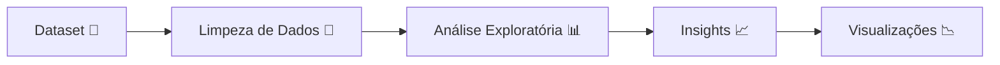
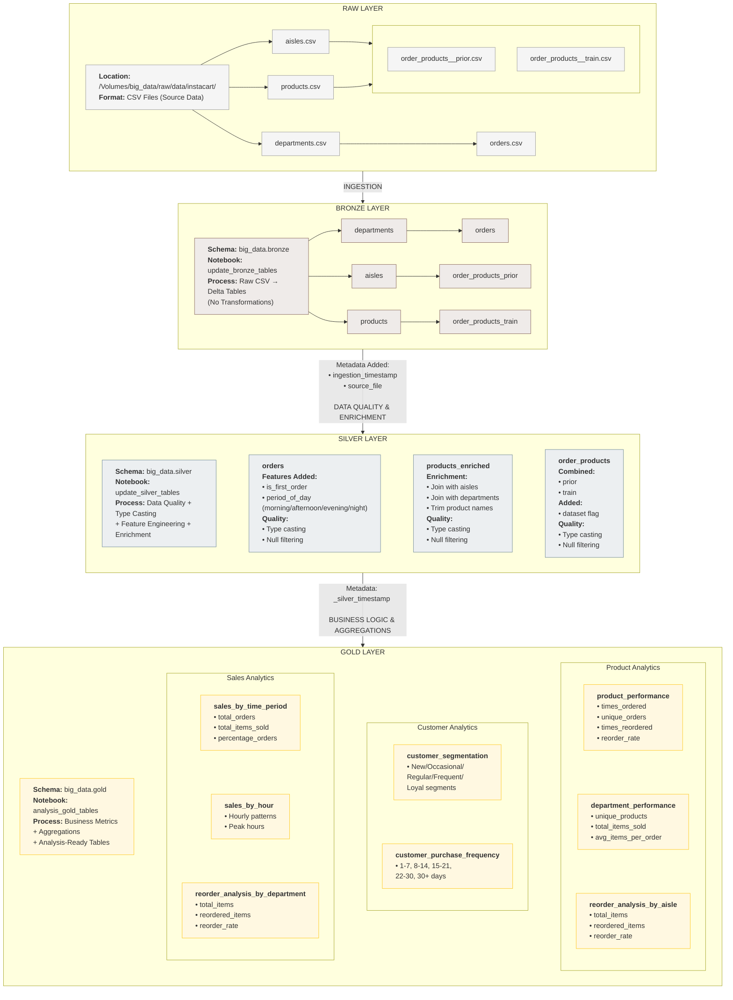

# 🎓 E-commerce Analysis

> Projeto de análise de dados de e-commerce utilizando **Databricks + Apache Spark (PySpark)** para processamento distribuído, além de técnicas de exploração, visualização e extração de insights.


## 📋 Visão Geral do Projeto

O **E-commerce Analysis** é um projeto focado na análise de dados de um ambiente de comércio eletrônico, com o objetivo de extrair insights relevantes sobre vendas, clientes, produtos e logística.

Este projeto pode envolver técnicas de:
- Análise exploratória de dados (EDA)
- Limpeza e tratamento de dados
- Visualização de dados
- Modelagem analítica (opcional)

🔗 **Link do Repositório:** https://github.com/Kal-0/e-commerce_analysis

---

## 🏗️ Arquitetura e Organização do Projeto

### Estrutura de Diretórios
```bash
.
├── src/
│   └── ETL/
│       ├── 0. RAW/
│       │   └── ingest_Instacart_kaggle.ipynb    # Ingestão dos dados brutos do Kaggle
│       ├── 1.BRONZE/
│       │   └── update_bronze_tables.ipynb       # Carga dos dados brutos para o formato Delta (sem transformações)
│       ├── 2.SILVER/
│       │   └── update_silver_tables.ipynb       # Limpeza, tipagem, enriquecimento e qualidade de dados
│       └── 3.GOLD/
│           └── analysis_gold_tables.ipynb       # Agregações, métricas de negócio e tabelas para análise
├── .gitignore                                   # Arquivos e pastas ignorados pelo Git (ex: dados locais)
├── diagram.md                                   # Diagrama Mermaid da Arquitetura Medallion
└── README.md                                    # Documentação principal do projeto
```
### Fluxo de análise


### Diagrama de Arquitetura


## 🛠️ Stack Tecnológica

* **Linguagem:** Python 3.x
* **Análise de Dados:** Pandas, NumPy
* **Visualização:** Matplotlib, Seaborn
* **Ambiente:** Jupyter Notebook / VS Code
* **(Opcional):** SQL / Power BI / Tableau

## 🚀 Como Executar Localmente

### Pré-requisitos
* Python 3 instalado
* Pip ou Conda

### Passo a Passo (Databricks)

1. **Acesse o Databricks:**
   - Entre na sua workspace do Databricks.

2. **Importe o repositório:**
   - Vá em **Workspace** → **Create** → **Git Folder**
   - Cole o link do repositório:
     ```
     https://github.com/Kal-0/e-commerce_analysis
     ```

3. **Configure o Cluster:**
   - Crie ou selecione um cluster (Runtime padrão já é suficiente para Python e Spark).

4. **Execute os notebooks:**
   - Abra os notebooks dentro do projeto
   - Clique em **Run All** para executar todas as células

5. **Visualize os resultados:**
   - Os outputs (gráficos, tabelas e insights) serão exibidos diretamente no notebook


## 🔄 Pipeline de Análise
O fluxo típico do projeto segue as etapas abaixo:

1. Coleta ou carregamento dos dados
2. Limpeza e pré-processamento
3. Análise exploratória
4. Geração de visualizações
5. Extração de insights

## 🧪 Estratégia de Análise
* Identificação de padrões de compra
* Análise de comportamento de clientes
* Avaliação de performance de vendas
* Análise de logística e entregas

## 📊 Resultados e Insights

## 📊 Evidências

## 📜 Licença
MIT — Livre para uso acadêmico.

## 👥 Colaboradores

| [<br><sub>Caio Hirata</sub>](https://github.com/Kal-0) | [<br><sub>Camila Cirne</sub>](https://github.com/camilacirne) | [<br><sub>Diogo Correia</sub>](https://github.com/DiogoHMC) | [<br><sub>Flávio Muniz</sub>](https://github.com/flavio-muniz) | [<br><sub>Pedro Coelho</sub>](https://github.com/pedro-coelho-dr) | 
| :---: | :---: | :---: | :---: | :---: |


