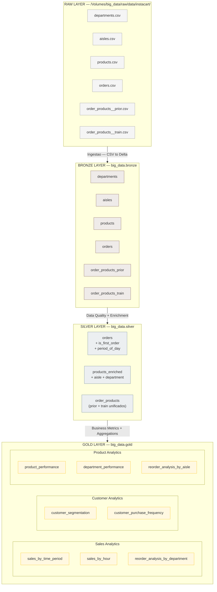

# Arquitetura do Pipeline — Medallion Architecture

## Visao Geral

O pipeline segue a arquitetura Medallion, organizada em quatro camadas progressivas de refinamento dos dados. Todo o processamento ocorre no **Databricks** com **Apache Spark (PySpark)** e armazenamento em **Delta Lake**.

```
Kaggle (CSV) → RAW → BRONZE → SILVER → GOLD
```

---

## Camadas

### RAW
- **Localizacao:** `/Volumes/big_data/raw/data/instacart/`
- **Formato:** CSV original do Kaggle
- **Notebook:** `SRC/ETL/0.RAW/ingest_Instacart_kaggle.ipynb`
- **Descricao:** Ingestao dos arquivos brutos do Kaggle para o volume do Databricks, sem qualquer transformacao. Ponto de origem imutavel dos dados.

### BRONZE
- **Schema:** `big_data.bronze`
- **Formato:** Delta Tables
- **Notebook:** `SRC/ETL/1.BRONZE/update_bronze_tables.ipynb`
- **Descricao:** Carga direta dos CSVs da camada RAW para tabelas Delta, sem transformacoes de negocio. Adiciona metadados de controle:
  - `ingestion_timestamp`
  - `source_file`

Tabelas geradas: `departments`, `aisles`, `products`, `orders`, `order_products_prior`, `order_products_train`

### SILVER
- **Schema:** `big_data.silver`
- **Formato:** Delta Tables
- **Notebook:** `SRC/ETL/2.SILVER/update_silver_tables.ipynb`
- **Descricao:** Camada de qualidade e enriquecimento. Aplica limpeza, tipagem correta, joins e feature engineering.

Tabelas geradas e transformacoes aplicadas:

| Tabela | Transformacoes |
|---|---|
| `orders` | Type casting, filtragem de nulos, criacao de `is_first_order` e `period_of_day` (morning/afternoon/evening/night) |
| `products_enriched` | Join com `aisles` e `departments`, trim de nomes, type casting, filtragem de nulos |
| `order_products` | Union de `prior` + `train`, adicao de flag `dataset`, type casting, filtragem de nulos |

Metadado adicionado: `_silver_timestamp`

### GOLD
- **Schema:** `big_data.gold`
- **Formato:** Delta Tables
- **Notebook:** `SRC/ETL/3.GOLD/analysis_gold_tables.ipynb`
- **Descricao:** Camada analitica com agregacoes e metricas de negocio prontas para consumo.

Tabelas geradas:

**Sales Analytics**
- `sales_by_time_period` — total de pedidos, itens vendidos e percentual por periodo do dia
- `sales_by_hour` — padroes de compra por hora, identificacao de horarios de pico
- `reorder_analysis_by_department` — taxa de recompra por departamento

**Customer Analytics**
- `customer_segmentation` — segmentos: New / Occasional / Regular / Frequent / Loyal
- `customer_purchase_frequency` — distribuicao por intervalo de dias entre compras

**Product Analytics**
- `product_performance` — vezes comprado, pedidos unicos, taxa de recompra
- `department_performance` — produtos unicos, total vendido, media de itens por pedido
- `reorder_analysis_by_aisle` — taxa de recompra por corredor

---

## Diagrama



---

## Estrutura de Diretorios

```
SRC/
└── ETL/
    ├── 0.RAW/
    │   └── ingest_Instacart_kaggle.ipynb
    ├── 1.BRONZE/
    │   └── update_bronze_tables.ipynb
    ├── 2.SILVER/
    │   └── update_silver_tables.ipynb
    └── 3.GOLD/
        └── analysis_gold_tables.ipynb
```

---

## Stack Tecnologica

| Componente | Tecnologia |
|---|---|
| Plataforma | Databricks |
| Processamento distribuido | Apache Spark / PySpark |
| Armazenamento / ACID | Delta Lake |
| Linguagem | Python 3.x |
| Formato de origem | CSV |
| Formato de destino | Delta Tables |
| Visualizacao | Matplotlib, Seaborn |
| Controle de versao | Git / GitHub |
